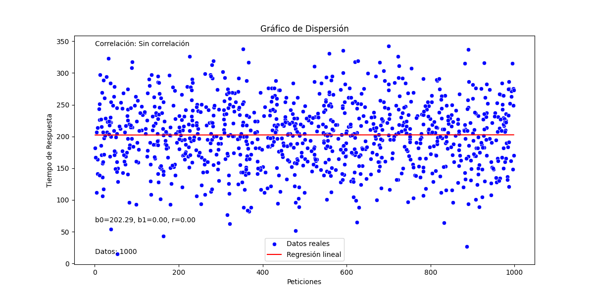

# linearRegression

2024-10-25 15:15:39,056 - INFO - Calculando parámetros de regresión lineal para el primer conjunto de datos...
2024-10-25 15:15:39,057 - INFO - La correlación es correlación positiva muy fuerte
2024-10-25 15:15:39,057 - INFO - Resultados del primer conjunto de datos: b0=37.50, b1=2.50, Correlación=1.00
2024-10-25 15:15:39,057 - INFO - Calculando parámetros de regresión lineal para el segundo conjunto de datos...
2024-10-25 15:15:39,058 - INFO - La correlación es correlación positiva muy fuerte
2024-10-25 15:15:39,058 - INFO - Resultados del segundo conjunto de datos: b0=0.62, b1=0.13, Correlación=1.00
2024-10-25 15:15:39,058 - INFO - Generando gráficas...
2024-10-25 15:15:39,372 - INFO - Gráficas generadas exitosamente.
2024-10-25 15:15:39,372 - INFO - Imprimiendo resultados finales...
2024-10-25 15:15:39,372 - INFO - Resultados finales impresos.
Resultados del primer conjunto de datos:
b0: 37.50
b1: 2.50
Correlación: correlación positiva muy fuerte

Resultados del segundo conjunto de datos:
b0: 0.62
b1: 0.13
Correlación: correlación positiva muy fuerte

## Verision dos ( con mas datos )

2024-10-28 18:43:03,543 - INFO - Generando datos ficticios...
2024-10-28 18:43:03,543 - INFO - Creando DataFrame con los datos generados...
2024-10-28 18:43:03,544 - INFO - Guardando datos en el archivo CSV: datos_peticiones.csv...
2024-10-28 18:43:03,548 - INFO - Archivo CSV generado con éxito.
2024-10-28 18:43:03,549 - INFO - Leyendo el archivo CSV...
2024-10-28 18:43:03,551 - INFO - DataFrame cargado exitosamente. Dimensiones: (1000, 3)
2024-10-28 18:43:03,551 - INFO - Calculando sumatorias necesarias...
2024-10-28 18:43:03,551 - INFO - Suma de x (Peticiones): 505116
2024-10-28 18:43:03,551 - INFO - Suma de y (Tiempo_Respuesta): 202438.97749165018
2024-10-28 18:43:03,551 - INFO - Suma de xy: 102279504.49524981
2024-10-28 18:43:03,551 - INFO - Suma de x^2: 337683636
2024-10-28 18:43:03,552 - INFO - Suma de y^2: 43661313.24404168
2024-10-28 18:43:03,552 - INFO - Calculando promedios...
2024-10-28 18:43:03,552 - INFO - Promedio de x (Peticiones): 505.116
2024-10-28 18:43:03,552 - INFO - Promedio de y (Tiempo_Respuesta): 202.43897749165018
2024-10-28 18:43:03,552 - INFO - Calculando coeficientes de la regresión lineal...
2024-10-28 18:43:03,552 - INFO - Coeficiente b1: 0.0002948571521185414
2024-10-28 18:43:03,552 - INFO - Coeficiente b0: 202.29004042640068
2024-10-28 18:43:03,552 - INFO - Calculando coeficiente de correlación...
2024-10-28 18:43:03,552 - INFO - Coeficiente de correlación (r): 0.0016364347430565375
2024-10-28 18:43:03,552 - INFO - Coeficiente de determinación (r^2): 2.6779186682825157e-06
2024-10-28 18:43:03,552 - INFO - Tipo de correlación: Sin correlación
2024-10-28 18:43:03,552 - INFO - Calculando predicciones...
2024-10-28 18:43:03,552 - INFO - Preparando el gráfico de dispersión...
2024-10-28 18:43:06,686 - INFO - Gráfico de dispersión generado y mostrado.
2024-10-28 18:43:06,686 - INFO - Guardando los resultados en un archivo CSV...
2024-10-28 18:43:06,691 - INFO - Resultados finales impresos y exportados a CSV.
2024-10-28 18:43:06,691 - INFO - Proceso completado exitosamente.

Resultados:
b0: 202.29
b1: 0.00029
Correlación: Sin correlación
Coeficiente de correlación (r): 0.00164